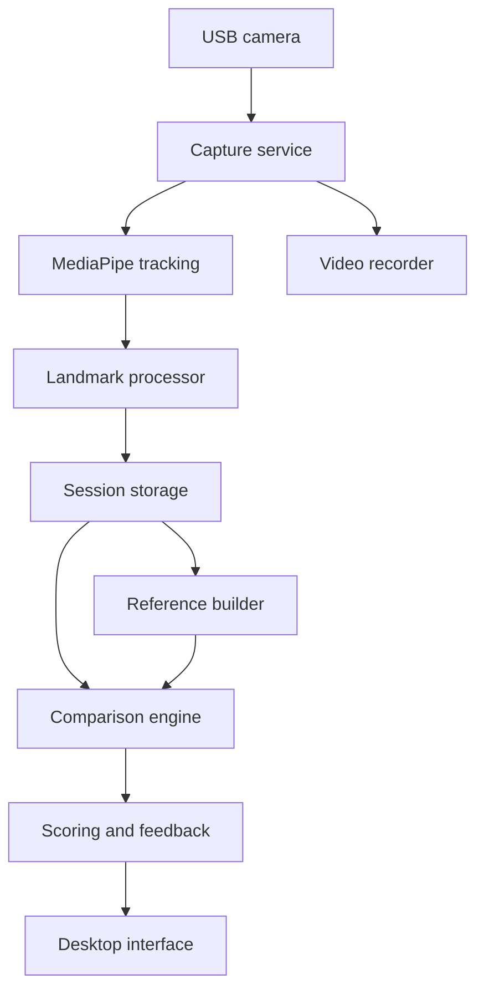

# Hand Motion Skill Assessment System

**Product Requirements Document**  
**Working title:** MotionMentor  
**Version:** 1.0  
**Status:** Ready for prototype development  
**Primary platform:** Local desktop computer with USB camera  
**Primary implementation language:** Python 3.11+  

---

## 1. Executive Summary

MotionMentor is a local computer-vision application that records an expert performing a hand-based task, converts the demonstration into a time-series representation of hand landmarks, and compares a trainee's attempt with the expert reference.

The first release will evaluate motion similarity using explainable measurements such as hand pose, joint angles, wrist orientation, movement path, timing, and sequence order. Later releases will add real-time feedback, tool and component tracking, full upper-body context, action recognition, learned scoring models, and support for multiple cameras or depth sensors.

The system will begin as a Python desktop application using a standard USB camera, OpenCV, and MediaPipe Hand Landmarker. All processing and data storage will be local by default.

---

## 2. Problem Statement

Traditional procedural training often relies on an instructor visually observing a trainee. This approach can be subjective, difficult to scale, and unable to quantify small differences in technique, trajectory, timing, or hand configuration.

The proposed system will answer:

> How closely did a trainee reproduce an expert's demonstrated hand movement, and what specific corrections would improve the trainee's performance?

The product must provide more than a single similarity number. It should explain where the trainee differed from the reference and eventually determine whether those differences affect the correctness or safety of the task.

---

## 3. Product Vision

Create an explainable visual skill-assessment platform that can evolve from simple hand-motion comparison into a contextual procedural-training system capable of understanding hands, body posture, tools, components, task stages, and completion outcomes.

### Long-term vision

- Capture expert knowledge as reusable motion templates.
- Evaluate trainees consistently and objectively.
- Provide immediate, actionable coaching.
- Recognize acceptable variations rather than requiring robotic imitation.
- Understand whether the physical task was completed correctly.
- Support industrial maintenance, assembly, signaling, healthcare, sports, and other physical-skills training.

---

## 4. Goals and Non-Goals

### 4.1 Goals

- Capture one or both hands from a local USB camera.
- Track 21 landmarks per detected hand over time.
- Record synchronized source video, landmarks, timestamps, and confidence values.
- Create an expert reference from multiple demonstrations.
- Normalize for hand size, starting position, and camera framing.
- Align expert and trainee sequences performed at different speeds.
- Produce component scores for pose, trajectory, orientation, timing, speed, and sequence.
- Display visual and textual feedback explaining the largest deviations.
- Retain raw data so scoring algorithms can improve without rerecording sessions.
- Operate locally without requiring a cloud account.
- Establish an architecture that can later include tools, objects, body pose, and learned temporal models.

### 4.2 Non-Goals for the MVP

- Certifying that a safety-critical procedure was performed correctly.
- Supporting arbitrary actions without setup or reference demonstrations.
- Accurately measuring absolute force, grip pressure, or torque.
- Handling severe hand occlusion or hands hidden inside equipment.
- Multi-user cloud collaboration.
- Mobile, XR, or RealWear deployment.
- Replacing a qualified instructor in regulated environments.

---

## 5. Target Users

### Expert or Instructor

- Defines an activity and its expected stages.
- Records several correct demonstrations.
- Identifies important checkpoints and scoring weights.
- Reviews trainee attempts and adjusts tolerances.

### Trainee

- Selects an activity.
- Performs the movement in front of the camera.
- Receives a score, playback overlay, and correction suggestions.
- Repeats the attempt and reviews improvement over time.

### Training Administrator — later phase

- Manages activities, scoring profiles, users, and reports.
- Reviews aggregate performance and common failure patterns.

---

## 6. Representative Use Cases

1. Compare a trainee's hand signal with an expert aircraft-marshalling signal.
2. Evaluate the sequence and orientation used to grasp and position a component.
3. Compare the wrist and finger motion used during an inspection technique.
4. Evaluate a repeated assembly movement for consistency.
5. Coach rehabilitation, sports, or musical hand exercises where motion quality matters.

The initial prototype should use a short action lasting approximately 2–10 seconds with both hands visible and minimal object occlusion.

---

## 7. Product Principles

1. **Explainability over black-box scoring:** Show what differed, not merely a percentage.
2. **Multiple valid executions:** Model an acceptable range from several expert demonstrations.
3. **Separate motion similarity from task correctness:** Looking similar does not prove that the task succeeded.
4. **Confidence-aware feedback:** Do not penalize the trainee when landmark tracking is unreliable.
5. **Preserve raw evidence:** Store video and landmarks for replay, debugging, and future reprocessing.
6. **Local-first privacy:** Keep video and biometric motion data on the user's computer by default.

---

## 8. Proposed Technical Stack

| Area | Recommended technology | Purpose |
|---|---|---|
| Language | Python 3.11+ | Primary application language |
| Camera/video | OpenCV | USB camera capture, frame handling, recording, overlays |
| Hand tracking | MediaPipe Hand Landmarker | 21 landmarks, handedness, normalized/world coordinates |
| Numerical processing | NumPy | Landmark arrays, vector math, normalization |
| Signal processing | SciPy | Smoothing, interpolation, filtering |
| Sequence comparison | Custom constrained DTW initially | Time alignment with explainable control over constraints |
| Tabular data | Pandas | Analysis and exports |
| Local database | SQLite | Activities, sessions, attempts, scores, configuration |
| Data models | Pydantic | Validated schemas and configuration |
| Desktop UI | OpenCV windows in Phase 1; PySide6 in Phase 3 | Fast prototype followed by maintainable desktop UI |
| Charts | Matplotlib or Plotly | Error timelines and score visualization |
| ML — later | PyTorch | Temporal classifiers and learned similarity models |
| Object tracking — later | Ultralytics YOLO or equivalent | Tool and component detection/pose |
| Testing | pytest | Unit, integration, and regression tests |

### Why Python

Python provides the shortest path from camera capture to landmark processing, numerical comparison, visualization, and later machine learning. The architecture should keep capture, scoring, and UI separated so performance-critical components can later be optimized or exported without replacing the entire application.

---

## 9. System Architecture



### Core modules

- **Capture service:** Opens the selected camera, validates frame rate/resolution, timestamps frames, and detects dropped frames.
- **Tracking service:** Runs MediaPipe and returns landmarks, handedness, and confidence metadata.
- **Preprocessor:** Smooths, interpolates short gaps, normalizes coordinates, and derives motion features.
- **Reference builder:** Combines multiple expert demonstrations into a reference profile and tolerance envelope.
- **Alignment engine:** Aligns trainee and expert feature sequences using constrained Dynamic Time Warping.
- **Scoring engine:** Produces component and overall scores with confidence intervals or reliability flags.
- **Feedback engine:** Converts deviations into understandable coaching messages.
- **Storage layer:** Stores activity definitions, recordings, landmark data, derived features, scores, and configuration.
- **Desktop UI:** Supports setup, recording, playback, comparison, and reporting.

---

## 10. Phased Development Plan

## Phase 0 — Feasibility and Capture Validation

**Objective:** Prove that the selected USB camera and physical setup produce landmarks reliable enough for comparison.

### Requirements

- Enumerate available cameras and select a camera index.
- Preview the camera feed at 720p and target 30 FPS.
- Display detected left/right hand skeletons and landmark confidence.
- Measure effective FPS, inference latency, dropped frames, and percentage of frames with a detected hand.
- Record a short test video and corresponding timestamped landmark file.
- Provide a simple setup guide for camera height, distance, lighting, background, and working area.

### Recommended constraints

- Fixed camera on a tripod or stable mount.
- Camera positioned consistently between sessions.
- Even front lighting with limited glare and motion blur.
- Hands remain within a marked capture zone.
- Initial action uses one hand and avoids tool occlusion.

### Deliverables

- `camera_test.py`
- Live skeleton overlay
- Video plus landmark recording
- Capture-quality report
- Selected benchmark action

### Exit criteria

- At least 90% of relevant frames contain the expected hand.
- Median processing rate is at least 24 FPS on the target computer.
- No persistent left/right hand identity swaps during the benchmark action.
- Repeated recordings produce visually stable landmark trajectories.

---

## Phase 1 — Landmark Recording and Session Replay

**Objective:** Build a reliable data-acquisition pipeline for expert and trainee recordings.

### Functional requirements

- Create and name an activity.
- Select role: `expert` or `trainee`.
- Show a three-second countdown before recording.
- Start and stop recording from the keyboard or UI.
- Save source video, camera metadata, timestamps, and landmarks.
- Track up to two hands while preserving handedness and per-frame identity.
- Replay a session with the hand skeleton overlaid.
- Flag frames with missing or low-confidence landmarks.
- Export session data as JSON or Parquet.

### Processing requirements

- Use monotonic timestamps rather than assuming constant frame rate.
- Preserve raw landmark output before smoothing.
- Smooth noisy trajectories using a configurable filter such as One Euro, Savitzky–Golay, or low-pass filtering.
- Interpolate only short gaps under a configurable threshold, initially 100–150 ms.
- Mark longer gaps as invalid instead of inventing motion.

### Exit criteria

- A user can record and replay at least ten sessions without data corruption.
- Video and landmark timelines remain synchronized within one frame.
- Raw and processed landmarks are independently accessible.
- Invalid or low-confidence intervals are visible during replay.

---

## Phase 2 — Expert Reference and Baseline Comparison MVP

**Objective:** Compare a trainee attempt with an expert reference and return an explainable score.

### Expert reference creation

- Require a minimum of five expert demonstrations for an activity; recommend 10–20 when practical.
- Validate that each demonstration contains the correct number of hands and sufficient tracking quality.
- Select a representative demonstration using medoid selection or create an averaged reference after temporal alignment.
- Calculate acceptable variation for each feature and task stage.
- Allow the expert to exclude a bad take.
- Version the reference profile when demonstrations or weights change.

### Normalization

The system must reduce irrelevant variation before comparison:

- Translate hand landmarks so the wrist or hand center is the local origin.
- Scale by a stable palm measurement, such as wrist-to-middle-finger MCP distance.
- Rotate into a hand-centered coordinate system when appropriate.
- Mirror left-handed demonstrations only when the activity permits mirrored execution.
- Retain global wrist trajectory separately because local normalization removes movement through the workspace.
- Optionally calibrate a workspace plane or printed calibration target for more reliable global measurements.

### Derived features

- Finger joint angles
- Finger extension and flexion
- Pairwise landmark distances
- Palm normal and hand orientation
- Wrist position and trajectory
- Linear and angular velocity
- Acceleration and motion smoothness
- Relative configuration between two hands
- Gesture or stage duration
- Pause locations and duration

### Temporal alignment

- Implement constrained Dynamic Time Warping.
- Align feature sequences while allowing reasonable speed differences.
- Limit excessive warping so an incorrect pause or reordered motion cannot appear correct.
- Return the alignment path for visualization and debugging.
- Support resampling to a standard frequency before alignment.

### Initial component scores

| Component | Initial weight | Meaning |
|---|---:|---|
| Local hand pose | 25% | Finger and joint configuration |
| Global trajectory | 25% | Path of wrist/hand through the workspace |
| Hand orientation | 15% | Palm and wrist rotation |
| Timing and duration | 15% | Overall duration, stage timing, and pauses |
| Speed and smoothness | 10% | Velocity profile, acceleration, and jerk |
| Sequence/checkpoints | 10% | Required poses or stages occurred in order |

Weights must be configurable per activity and total 100%.

### Scoring behavior

- Convert feature errors into 0–100 scores using expert-derived tolerances.
- Reduce or suppress scoring during low-confidence intervals.
- Produce an overall reliability indicator: `high`, `medium`, or `low`.
- Report raw measurement differences alongside normalized scores.
- Prevent a high overall score from hiding failure of a required checkpoint.
- Allow activity-specific critical errors that cap or fail the result.

### Exit criteria

- The same expert repeating the action generally scores higher than deliberately incorrect performances.
- Speed variations within the allowed range do not substantially lower pose or trajectory scores.
- The output identifies at least the three largest deviations.
- A reviewer can inspect how every component score was calculated.
- Automated tests cover normalization, feature extraction, alignment, and scoring.

---

## Phase 3 — Coaching Interface and Performance History

**Objective:** Turn the comparison engine into a usable training application.

### Desktop experience

- Build a PySide6 desktop interface.
- Provide workflows for camera setup, activity selection, expert recording, trainee recording, and review.
- Display expert and trainee playback side by side.
- Offer synchronized playback with play, pause, scrub, and frame-step controls.
- Overlay skeletons using distinct colors.
- Optionally display both aligned skeletons on one normalized canvas.
- Highlight joints with the largest errors.
- Display an error timeline and component score cards.
- Generate plain-language correction messages.

### Example feedback

- “Rotate your wrist earlier during the approach.”
- “Your index finger remained approximately 14° more flexed than the expert reference.”
- “The downward movement began 0.5 seconds before the required checkpoint.”
- “Tracking confidence was low while your hand passed behind the tool; repeat the attempt.”

### Progress tracking

- Store attempts by trainee and activity.
- Show score history and improvement by component.
- Allow instructor notes.
- Export a session report as CSV initially; add PDF later if required.
- Compare an attempt against the reference version active when it was recorded.

### Exit criteria

- A new user can complete a recording and understand the result without developer assistance.
- Feedback points to a specific time range and measurable deviation.
- The user can replay the exact segment associated with each correction.
- Historical results remain reproducible after reference profiles are updated.

---

## Phase 4 — Task Stages, Tools, and Component Context

**Objective:** Evaluate whether the hand interacted with the correct item in the correct way, not merely whether its motion looked similar.

### Functional additions

- Add MediaPipe Pose or Holistic landmarks for shoulders, elbows, and upper-body posture.
- Detect and track relevant tools and components.
- Define activity stages such as `approach`, `grasp`, `align`, `operate`, `release`, and `verify`.
- Measure hand-to-tool, tool-to-component, and hand-to-component spatial relationships.
- Detect incorrect tool selection, missing contact, wrong approach direction, or omitted stages.
- Permit instructor-defined checkpoints and regions of interest.
- Add object-state verification where visually observable.

### Contextual scoring examples

- Correct hand approached the correct component.
- Tool was grasped before the operation stage.
- Tool orientation remained within tolerance.
- Required component was contacted.
- Release occurred only after the completion state was visible.

### Technical approach

- Begin with YOLO bounding-box detection and tracking.
- Add segmentation or object keypoints when bounding boxes are insufficient.
- Use fiducial-free tracking for the product experience; calibration targets may still be used during development or workspace calibration.
- Represent the procedure as a finite-state machine before introducing learned sequence models.

### Exit criteria

- The system distinguishes visually similar hand motions performed on the wrong object.
- Each required task stage has observable entry and completion conditions.
- Tool/component tracking confidence is incorporated into result reliability.
- A missing critical stage causes a clear failure regardless of motion similarity.

---

## Phase 5 — Learned Action Recognition and Adaptive Scoring

**Objective:** Learn acceptable execution patterns from data and recognize action meaning.

### Candidate capabilities

- Classify a complete action or individual task stage.
- Detect incorrect or unsafe action variants.
- Learn a similarity embedding from expert and trainee sequences.
- Model several acceptable expert styles.
- Personalize tolerances based on handedness or physical constraints.
- Automatically identify the beginning and end of an action.

### Candidate models

- LSTM or GRU baseline
- Temporal convolutional network
- Transformer encoder
- Spatial-temporal graph neural network over landmarks
- Multimodal model combining landmarks, RGB features, and object tracks

### Dataset requirements

- Multiple participants, camera sessions, body sizes, speeds, and lighting conditions.
- Correct demonstrations plus labeled error types.
- Activity-stage annotations.
- Train/validation/test splits separated by participant to test generalization.
- Balanced samples or appropriate loss weighting.
- Dataset and label versioning.

### Model evaluation

- Action and stage classification precision/recall/F1.
- Error-type detection metrics.
- Agreement with instructor ratings.
- False-pass rate for critical errors.
- Generalization to unseen participants.
- Calibration of confidence estimates.

### Exit criteria

- The learned model outperforms the deterministic baseline on a held-out, participant-separated test set.
- Model confidence is calibrated and low-confidence cases are routed for review.
- Deterministic measurements remain available for explanation.
- No model is promoted solely because it improves average accuracy while increasing critical false passes.

---

## Phase 6 — Real-Time Coaching and Deployment Expansion

**Objective:** Provide feedback during performance and prepare the platform for additional devices.

### Capabilities

- Streaming stage recognition.
- Real-time visual or audio cues.
- Configurable feedback delay to avoid distracting the trainee.
- On-device session buffering and recovery.
- Support for multiple synchronized cameras.
- Optional RGB-D or stereo input for better spatial measurements.
- API separation for future web, mobile, RealWear, or XR clients.
- Optional centralized user and training management.

### Safety requirement

Real-time feedback must be suppressible during task stages where interruption could be distracting or unsafe. Safety-critical feedback rules require domain-expert approval.

---

## 11. Functional Requirements

### FR-1 Camera configuration

- The application shall list available camera devices.
- The user shall be able to select resolution and target frame rate.
- The application shall remember the last valid configuration.
- The application shall report camera disconnects and allow reconnection.

### FR-2 Activity management

- The user shall be able to create, edit, archive, and duplicate activities.
- Each activity shall define expected hands, mirroring policy, scoring weights, required checkpoints, and capture instructions.
- Activity changes shall be versioned once used for a scored attempt.

### FR-3 Recording

- The application shall record expert and trainee sessions.
- Every processed frame shall use a monotonic timestamp.
- Video, landmarks, and session metadata shall share a session identifier.
- Recording failure shall not silently produce a score.

### FR-4 Reference management

- The instructor shall be able to include or exclude expert takes.
- The system shall display the variability of included expert demonstrations.
- Reference profiles shall be immutable after publication; edits create a new version.

### FR-5 Comparison

- The system shall compare an attempt with the appropriate activity reference.
- Component scores shall be independently accessible.
- The system shall return alignment, deviations, reliability, and detected critical failures.

### FR-6 Review

- The user shall be able to replay synchronized expert and trainee sequences.
- Selecting feedback shall navigate to the relevant interval.
- The system shall distinguish tracking problems from performance errors.

### FR-7 Export

- The user shall be able to export landmarks, features, scores, and summary results.
- Exports shall include schema and algorithm versions.

---

## 12. Data Model

### Activity

```json
{
  "activity_id": "uuid",
  "name": "Example hand procedure",
  "version": 1,
  "expected_hands": 1,
  "allow_mirroring": false,
  "target_fps": 30,
  "scoring_profile_id": "uuid",
  "capture_instructions": "Keep the full hand visible",
  "created_at": "ISO-8601"
}
```

### Session

```json
{
  "session_id": "uuid",
  "activity_id": "uuid",
  "activity_version": 1,
  "role": "expert",
  "participant_id": "local-id",
  "camera_id": "camera-index-or-device-id",
  "resolution": [1280, 720],
  "nominal_fps": 30,
  "model_version": "hand-landmarker-version",
  "started_at": "ISO-8601",
  "video_path": "relative/path.mp4",
  "landmark_path": "relative/path.parquet",
  "quality_summary": {}
}
```

### Landmark frame

```json
{
  "session_id": "uuid",
  "frame_index": 42,
  "timestamp_ms": 1400,
  "hand_track_id": 0,
  "handedness": "Right",
  "handedness_score": 0.98,
  "landmarks_image": [[0.1, 0.2, -0.01]],
  "landmarks_world": [[0.01, 0.02, -0.01]],
  "valid": true
}
```

The landmark arrays contain 21 ordered points. Parquet or NumPy storage is preferred for frame-level data; JSON is primarily an interchange format.

### Assessment result

```json
{
  "assessment_id": "uuid",
  "attempt_session_id": "uuid",
  "reference_profile_id": "uuid",
  "scoring_version": "1.0.0",
  "overall_score": 84.0,
  "reliability": "high",
  "component_scores": {
    "pose": 93.0,
    "trajectory": 87.0,
    "orientation": 71.0,
    "timing": 82.0,
    "smoothness": 80.0,
    "sequence": 88.0
  },
  "critical_failures": [],
  "feedback": [],
  "created_at": "ISO-8601"
}
```

---

## 13. Scoring Design

### 13.1 Error calculation

For feature \(f\) at aligned step \(t\):

\[
e_{f,t} = d(f^{trainee}_t, f^{reference}_t)
\]

The distance function depends on the feature:

- Euclidean distance for normalized landmark positions.
- Angular difference for joints and palm orientation.
- Relative error for duration and speed.
- Boolean or categorical penalties for checkpoints and sequence rules.

### 13.2 Tolerance-aware score

A feature should be scored relative to expert variation rather than an arbitrary perfect match:

\[
z_{f,t} = \frac{e_{f,t}}{\max(\sigma_{f,t}, \epsilon)}
\]

where \(\sigma\) represents expert variability and \(\epsilon\) prevents unstable division. A bounded mapping converts aggregated normalized error into a 0–100 score.

### 13.3 Confidence weighting

Each comparison point receives a reliability weight derived from landmark detection quality, interpolation status, occlusion, motion blur indicators, and camera continuity. Intervals below a minimum threshold are excluded or cause the attempt to be marked for repetition.

### 13.4 Overall score

\[
S_{overall} = \sum_i w_i S_i
\]

This weighted score is reported alongside component results. Critical checkpoint rules may cap the score or return `incomplete`/`failed` independently of the weighted average.

### 13.5 Initial interpretation bands

| Score | Label | Interpretation |
|---:|---|---|
| 90–100 | Excellent match | Within the expert range for most features |
| 80–89 | Good match | Minor corrections recommended |
| 70–79 | Developing | Several meaningful deviations |
| Below 70 | Needs review | Repeat with instructor feedback |

These bands are provisional and must be calibrated per activity against instructor judgments.

---

## 14. User Experience

### Primary MVP flow

1. Launch the application.
2. Select and test the USB camera.
3. Create or select an activity.
4. Record 5–10 expert takes.
5. Review and publish the expert reference.
6. Select “New Trainee Attempt.”
7. Read the framing instructions and enter the capture zone.
8. Record the movement after a countdown.
9. Wait for local processing.
10. Review overall score, component scores, reliability, and top corrections.
11. Replay aligned video and skeleton overlays.
12. Repeat the attempt and compare progress.

### Capture guidance

The preview should show:

- Working-area boundary
- Required hand count
- Hand-detection indicator
- Lighting or blur warning
- Readiness state
- Countdown and recording indicator

The record button should remain disabled when the minimum capture conditions are not met, unless an instructor explicitly overrides the warning.

---

## 15. Non-Functional Requirements

### Performance

- Target capture: 1280×720 at 30 FPS.
- Target landmark processing: at least 24 FPS on the development machine.
- Preview latency target: under 150 ms.
- Post-session MVP assessment target: under 5 seconds for a 10-second action.

### Reliability

- Use atomic writes or temporary files followed by rename to avoid partial session data.
- Detect camera disconnects and interrupted recordings.
- Store algorithm, model, activity, and reference versions with every score.
- Never report a normal score when required evidence is missing.

### Privacy and security

- Store data locally by default.
- Clearly identify video and landmarks as potentially sensitive biometric/behavioral data.
- Provide session deletion and configurable video retention.
- Do not enable cloud synchronization without explicit configuration and consent.
- Avoid using training footage for model training without authorization.

### Maintainability

- Separate UI, capture, processing, scoring, and persistence layers.
- Use typed interfaces and Pydantic schemas.
- Use configuration files for thresholds and scoring profiles.
- Version data schemas and scoring algorithms.

---

## 16. Proposed Repository Structure

```text
motion-mentor/
├── README.md
├── pyproject.toml
├── configs/
│   ├── default.yaml
│   └── activities/
├── data/
│   ├── motion_mentor.db
│   ├── recordings/
│   ├── landmarks/
│   └── references/
├── src/motion_mentor/
│   ├── app.py
│   ├── capture/
│   │   ├── camera.py
│   │   └── recorder.py
│   ├── tracking/
│   │   ├── hand_tracker.py
│   │   └── identity_tracker.py
│   ├── processing/
│   │   ├── smoothing.py
│   │   ├── normalization.py
│   │   └── features.py
│   ├── comparison/
│   │   ├── dtw.py
│   │   ├── reference.py
│   │   ├── scoring.py
│   │   └── feedback.py
│   ├── storage/
│   │   ├── database.py
│   │   ├── models.py
│   │   └── files.py
│   ├── ui/
│   └── reporting/
├── scripts/
│   ├── camera_test.py
│   ├── record_session.py
│   └── compare_sessions.py
└── tests/
    ├── fixtures/
    ├── test_normalization.py
    ├── test_features.py
    ├── test_dtw.py
    └── test_scoring.py
```

---

## 17. Testing Strategy

### Unit tests

- Coordinate translation, scaling, rotation, and mirroring.
- Joint-angle calculations.
- Smoothing and missing-frame handling.
- DTW alignment on known synthetic sequences.
- Score conversion and weighting.
- Critical checkpoint behavior.

### Integration tests

- Camera-to-recording pipeline.
- Video/landmark timestamp synchronization.
- Complete expert-reference creation.
- End-to-end trainee comparison.
- Database and file consistency after interruption.

### Evaluation dataset

Create a controlled benchmark containing:

- Correct repetitions at normal, slow, and fast speeds.
- Known wrist-angle errors.
- Known trajectory offsets.
- Missing checkpoint examples.
- Partial occlusion and hand-exits-frame examples.
- Different users and hand sizes.

### Human validation

Ask at least two qualified reviewers to independently score a sample of attempts. Compare system results with reviewer agreement and investigate cases where the system and reviewers disagree.

---

## 18. Risks and Mitigations

| Risk | Impact | Mitigation |
|---|---|---|
| Hand occlusion by tools/components | Missing or inaccurate landmarks | Camera guidance, alternate view, confidence gating, later multi-camera/depth support |
| Camera moves between sessions | Invalid global trajectory comparison | Stable mount, saved setup image, workspace calibration |
| Different execution speeds | False penalties | Constrained DTW and independent timing score |
| Single expert take is unrepresentative | Brittle scoring | Use multiple expert takes and variability envelopes |
| Estimated monocular depth is unstable | Incorrect 3D conclusions | Favor normalized angles/relative geometry; calibrate workspace; add RGB-D later |
| Left/right identity swaps | Corrupt sequence | Temporal identity tracking and handedness consistency checks |
| Motion looks correct but task fails | False pass | Add checkpoints, object state, tool interaction, and critical rules |
| Weighted score hides critical error | Unsafe interpretation | Required checkpoints and score caps |
| Model overfits known users | Poor generalization | Participant-separated evaluation and diverse recordings |
| Feedback is too technical | Low usability | Plain-language coaching linked to visual evidence |

---

## 19. Success Metrics

### MVP technical metrics

- Hand detection coverage of at least 90% during valid capture intervals.
- Median processing rate of at least 24 FPS.
- Video/landmark synchronization within one frame.
- Assessment produced in under five seconds for a ten-second recording.
- Same-action expert repetitions score consistently higher than seeded-error attempts.

### Product metrics

- At least 80% of pilot users complete an attempt without assistance.
- At least 80% of feedback items are rated understandable by trainees.
- Instructors agree with pass/review classification on at least 85% of pilot attempts.
- A trainee's repeated attempts show measurable improvement for the corrected component.

These are initial targets, not safety certification thresholds.

---

## 20. Suggested Milestones

| Milestone | Scope | Estimated effort |
|---|---|---:|
| M0 | Camera validation and skeleton preview | 2–4 days |
| M1 | Session recording, storage, and replay | 1–2 weeks |
| M2 | Normalization, features, DTW, and baseline scoring | 2–3 weeks |
| M3 | Expert reference builder and feedback visualization | 2–3 weeks |
| M4 | PySide6 training interface and history | 2–3 weeks |
| M5 | Tool/component proof of concept | 3–5 weeks |
| M6 | Temporal ML research prototype | Dataset-dependent |

Estimates assume one developer and one initially supported activity. Dataset collection and domain validation will dominate later phases.

---

## 21. MVP Definition of Done

The MVP is complete when:

- A user can configure a local USB camera.
- An instructor can create an activity and record at least five expert demonstrations.
- The system can build and version an expert reference.
- A trainee can record an attempt.
- The system normalizes and temporally aligns the attempt with the reference.
- The system reports pose, trajectory, orientation, timing, smoothness, and sequence scores.
- The result includes tracking reliability and at least three evidence-linked corrections.
- Expert and trainee recordings can be replayed in synchronized form with landmark overlays.
- Results and raw source data persist locally and can be exported.
- Automated tests verify the main mathematical and data-integrity paths.

---

## 22. Immediate Implementation Backlog

### Sprint 1 — Capture foundation

1. Initialize Python project and dependency management.
2. Implement camera enumeration and configuration.
3. Integrate MediaPipe Hand Landmarker in live-stream or video mode.
4. Draw hand skeleton and handedness on the preview.
5. Add FPS, latency, and detection-coverage diagnostics.
6. Save synchronized MP4 and raw landmark records.
7. Create a basic replay script.

### Sprint 2 — Motion representation

1. Define Pydantic schemas for activities and sessions.
2. Add smoothing and short-gap interpolation.
3. Implement local hand coordinate normalization.
4. Preserve global wrist trajectory as a separate feature.
5. Derive finger angles, palm orientation, velocity, and smoothness.
6. Add visual plots for each feature over time.

### Sprint 3 — Comparison MVP

1. Implement constrained DTW with alignment visualization.
2. Create the expert reference builder.
3. Calculate expert variability and tolerances.
4. Implement component scoring and reliability gating.
5. Add required checkpoint support.
6. Generate ranked feedback messages.
7. Build an end-to-end comparison command.

### First development experiment

Record one expert performing the same five-second movement ten times. Then record:

- A correct attempt at normal speed.
- A correct attempt at half speed.
- A correct attempt at faster speed.
- An attempt with an intentionally incorrect wrist rotation.
- An attempt with an intentionally incorrect trajectory.
- An attempt that omits the final pose.

The first scoring prototype succeeds if it remains tolerant of reasonable speed changes while correctly ranking the seeded errors in the affected components.

---

## 23. Future Questions

- Which first action provides the clearest business value and easiest ground truth?
- Is the action one-handed, two-handed, mirrored, or handedness-specific?
- Does absolute workspace position matter, or only hand-relative motion?
- Which mistakes are stylistic, which reduce quality, and which are safety-critical?
- What degree of instructor disagreement is acceptable?
- Should the product compare against an averaged expert profile, the closest valid expert style, or both?
- Is tool contact visible from one camera angle?
- Will future deployment require offline operation on constrained hardware?
- What retention policy should apply to videos and biometric motion data?

---

## 24. Reference Documentation

- [MediaPipe Hand Landmarker](https://ai.google.dev/edge/mediapipe/solutions/vision/hand_landmarker)
- [MediaPipe Gesture Recognizer](https://ai.google.dev/edge/mediapipe/solutions/vision/gesture_recognizer)
- [MediaPipe Holistic Landmarker](https://ai.google.dev/edge/mediapipe/solutions/vision/holistic_landmarker)
- [OpenCV Python documentation](https://docs.opencv.org/4.x/d6/d00/tutorial_py_root.html)

---

## 25. Final Recommendation

Begin with a single, short, one-handed activity and a fixed USB-camera setup. Build a transparent DTW-based comparison system before training an action-recognition model. This produces useful feedback quickly, establishes the data pipeline, and creates the labeled examples needed for more advanced machine learning.

The most important early architectural decision is to store raw video, raw landmarks, processed landmarks, features, model versions, reference versions, and scoring versions separately. That will allow every later algorithm to be evaluated against the same evidence without rerecording the original sessions.
